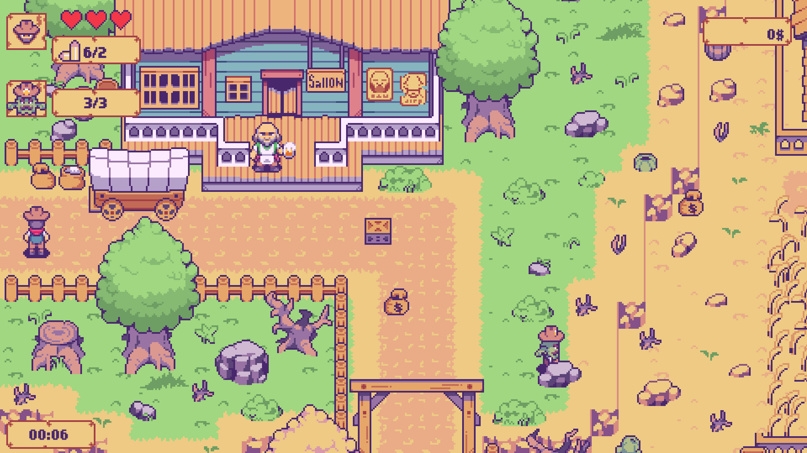
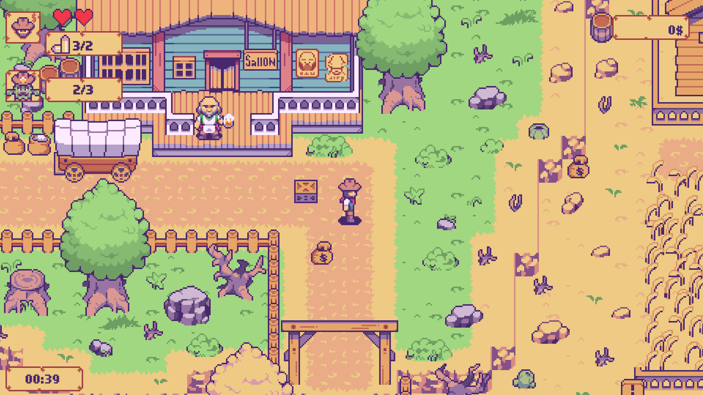
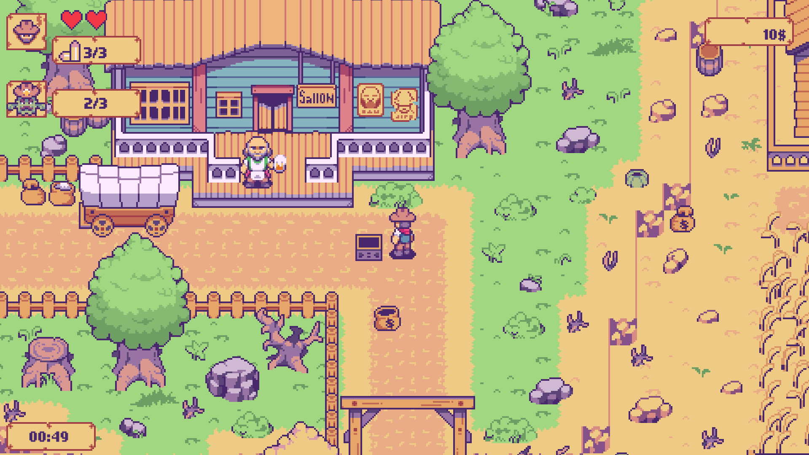
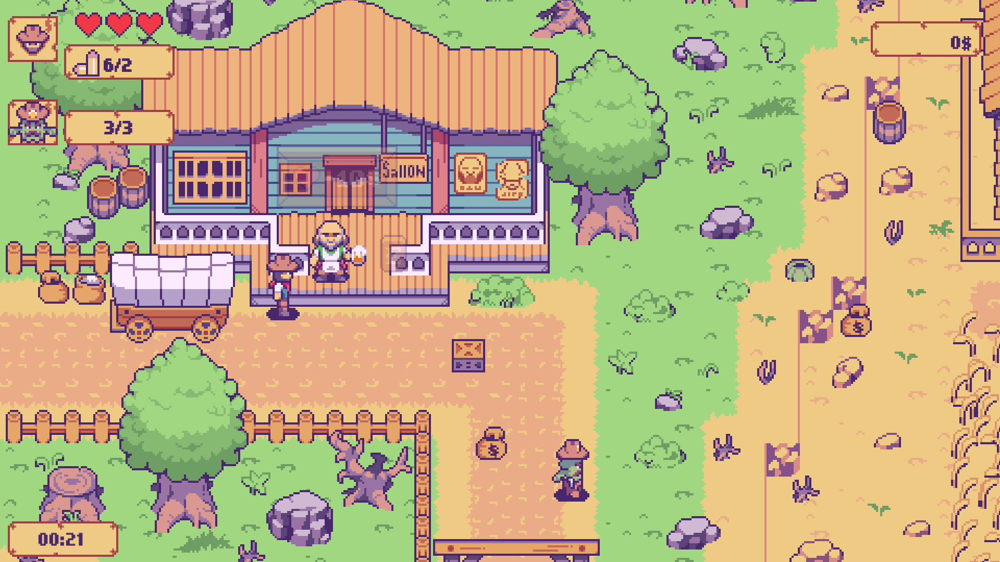
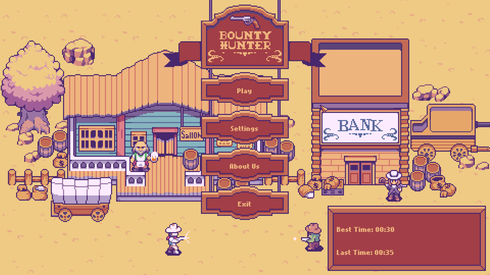
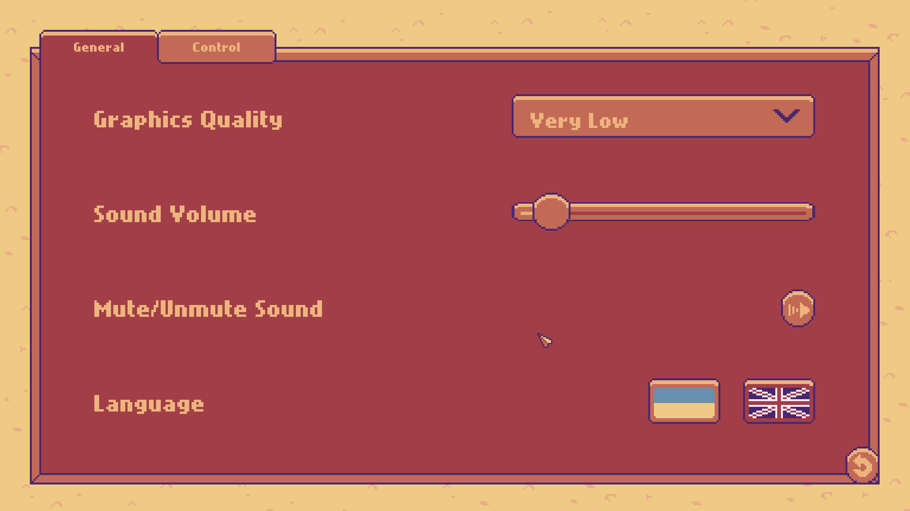
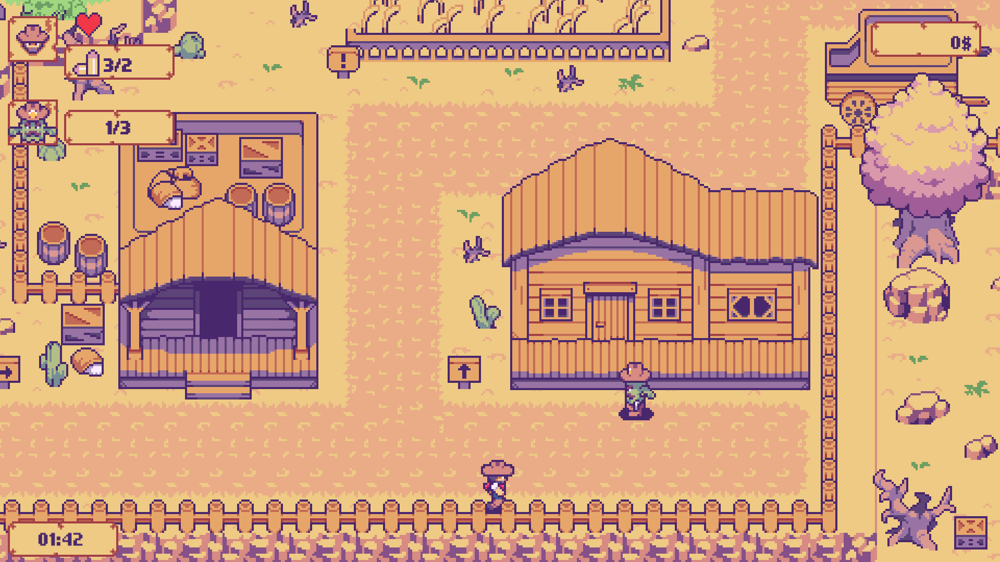
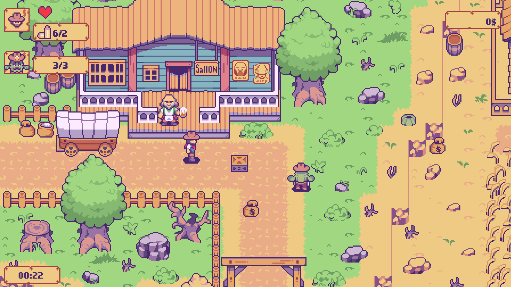

# 🤠 Bounty Hunter

A stylized 2D top-down action shooter game set in a classic Western atmosphere, developed using Unity. This project serves as a comprehensive showcase of core game development mechanics, custom C# architecture, localized UI systems, data persistence, and interactive NPC behaviors.

## 🎮 Gameplay & Core Loop

The game features a dedicated **Time Attack Demo Mode** designed to test player skills on a sprawling, thematic Western map built for future level expansions.

* **Objective:** The player spawns at the beginning of the level and must track down and eliminate **3 specific enemy NPCs** as fast as possible.

* **Score & Persistence:** The game tracks your performance and saves your records. Your **Best Time** and **Last Time** are dynamically displayed right in the Main Menu to encourage replayability.

* **Exploration & Loot:** The map is filled with breakable/interactive crates containing essential resources like ammo and bags of gold.

## 🔥 Key Features & Mechanics

### Interactive NPCs & Traders
* **Dynamic Economy:** The world features specialized Trader NPCs where players can spend collected gold to restock resources. One trader sells **Health (HP)**, while the other sells **Ammo**.

* **Aggressive Enemy AI (Cactus Gang):** Features 3 unique animated cactus enemies. They patrol the area, automatically engage the player when inside their detection radius (range), and relentlessly pursue the player once alerted.

## 📸 Other

### Main Menu Showcase

* **Interactive Interface:** Provides instant access to game modes while displaying your real-time records (**Best Time** and **Last Time**) dynamically fetched from persistence files.

* **Advanced Settings Panel:** Features interactive sliders for master volume control and a synchronized dropdown list for real-time graphics quality optimization.

* **Dual-Language Localization:** Built-in dynamic text switching between English and Ukrainian languages, automatically adjusting fonts, sizes, and styling formats across all interface components.

### Game Possible Endings

* **Mission Accomplished (Victory):** Triggers when all 3 enemy target NPCs are successfully eliminated. The system stops the gameplay timer, calculates the final completion time, compares it to previous attempts, and updates your personal high score data.

* **Wasted (Defeat):** Triggers instantly when the player's health points (HP) drop to zero. The run is terminated, your active record is discarded, and the interface prompts a restart window.

## 🛠️ Technical Implementation Details (C# & Unity)

* **Save System:** Implemented data persistence (via PlayerPrefs/JSON) to store and retrieve the player's personal high scores (`Best Time`) across game sessions.
* **AI Vision & State Logic:** Developed a custom detection range system for enemy NPCs using 2D triggers and physics casting, switching enemy states from *Patrol* to *Chase & Attack*.
* **Trader & Interaction System:** Built a modular interaction system enabling UI triggers and currency verification when purchasing items from different Traders.
* **UI/UX Architecture:** Designed a responsive pixel-perfect canvas layout for the main menu, option menus, and timers.

## 🚀 How to Play / Run the Project

### Play the Demo
* **Download Build:** https://github.com/Ellissium/bounty-hunter/releases/tag/v1.0.0

### Open in Unity Editor
1. Clone the repository: `git clone https://github.com`
2. Open the root folder using Unity Hub.
3. Recommended Unity Version: **2020.3.1f1** (or compatible LTS releases).

---
*Collaborative project developed as an educational assignment by **Yelysei Cherkov** (Ellissium) and **Mykola Tkachenko** (Whishare).*
